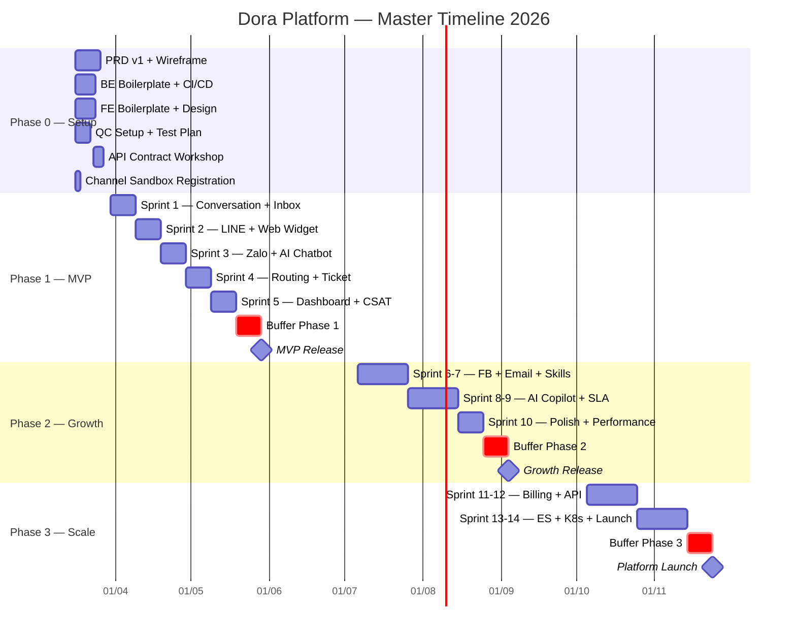
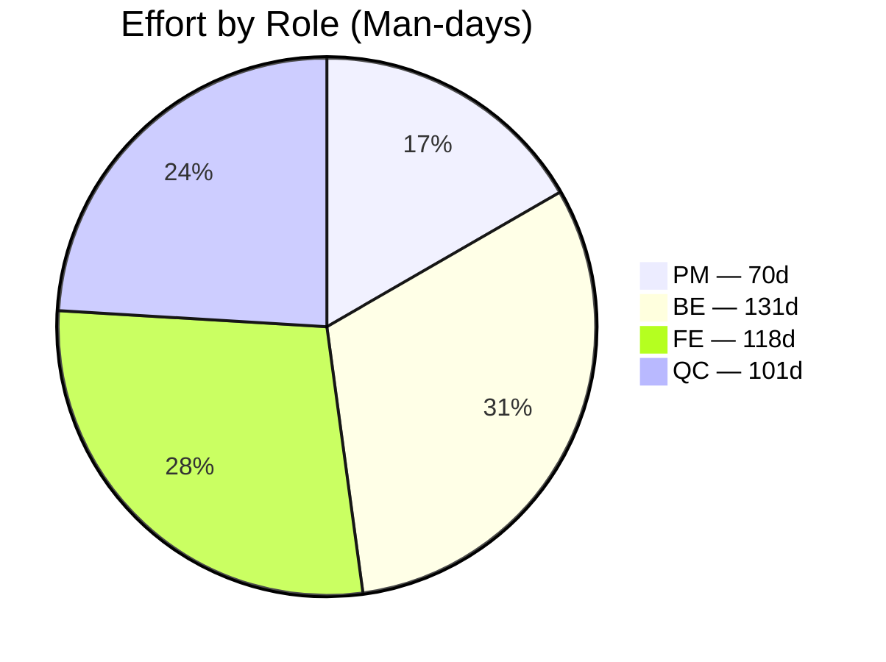
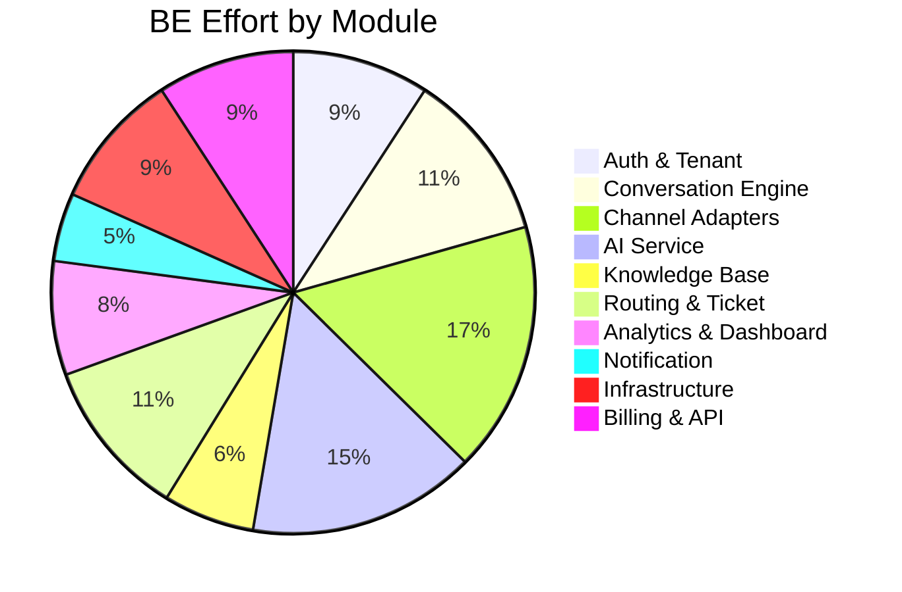

# Timeline & Estimation — Dora Platform

> Tài liệu ước lượng thời gian và nguồn lực cho toàn bộ dự án Dora, dành cho team 4 người.

---

## Team Composition

| Role | Qty | Trách nhiệm chính |
|------|-----|-------------------|
| **PM** | 1 | PRD, wireframe, API spec, stakeholder management, QA coordination |
| **BE** | 1 | NestJS backend, DB, WebSocket, AI integration, Channel Adapters |
| **FE** | 1 | Next.js 15, Unified Inbox UI, Chat Widget, Dashboard, Admin |
| **QC** | 1 | Test plan, manual testing, Playwright automation, regression |

---

## Assumptions

- **Sprint:** 2 tuần (10 working days)
- **Working days/tháng:** 22 ngày
- **Buffer:** 20% mỗi phase (sick leave, unexpected issues, learning curve)
- **Approach:** API-first — BE + FE thống nhất OpenAPI spec trước mỗi sprint
- **QC:** Tham gia từ đầu sprint, viết test plan song song với dev
- **PM:** Hoàn thành wireframe + PRD lead 1 sprint trước khi dev bắt đầu

---

## Master Timeline

### Timeline Table

| Phase | Sprint | Nội dung chính | Tuần | Thời gian | Output |
|-------|--------|---------------|------|-----------|--------|
| **Phase 0** | Setup | Boilerplate, CI/CD, PRD, Wireframe, API Spec | W1-2 | 16/03 → 27/03 | Foundation ready |
| **Phase 1** | Sprint 1 | Conversation Engine + Basic Inbox | W3-4 | 30/03 → 10/04 | Real-time chat |
| | Sprint 2 | LINE Adapter + Web Chat Widget | W5-6 | 13/04 → 24/04 | First channel live |
| | Sprint 3 | Zalo Adapter + AI Chatbot + KB | W7-8 | 27/04 → 08/05 | AI auto-reply |
| | Sprint 4 | Routing + Ticket + Notification | W9-10 | 11/05 → 22/05 | Auto-assignment |
| | Sprint 5 | Dashboard + CSAT + Multi-tenant | W11-12 | 25/05 → 05/06 | Analytics ready |
| | Buffer | Bug fix, UAT, polish | W13-14 | 08/06 → 19/06 | — |
| | **MVP Release** | | | **Mid Jun 2026** | **Beta users** |
| **Phase 2** | Sprint 6-7 | Facebook + Email + Skill Routing | W15-18 | 06/07 → 31/07 | 4 channels |
| | Sprint 8-9 | AI Copilot + SLA + Automation | W19-22 | 03/08 → 28/08 | Smart features |
| | Sprint 10 | Polish + Performance + Security | W23-24 | 31/08 → 11/09 | Production-grade |
| | Buffer | Regression, load test | W25-26 | 14/09 → 25/09 | — |
| | **Growth Release** | | | **End Sep 2026** | **Full features** |
| **Phase 3** | Sprint 11-12 | Billing + Public API + White-label | W27-30 | 05/10 → 30/10 | Monetization |
| | Sprint 13-14 | Elasticsearch + K8s + Launch prep | W31-34 | 02/11 → 27/11 | Scale-ready |
| | Buffer | Pen testing, final QA | W35-36 | 30/11 → 11/12 | — |
| | **Platform Launch** | | | **End Dec 2026** | **Public launch** |

---

## Phase 0 — Foundation & Setup (2 tuần)

**Timeline:** Tuần 1-2 | **Target:** End Mar 2026

| Task | Owner | Days | Notes |
|------|-------|------|-------|
| PRD v1.0 + User Stories Phase 1 | PM | 10 | Hoàn thành trước Sprint 1 |
| UI Wireframe (Figma) — Inbox, Widget, Dashboard | PM | 10 | Low-fidelity |
| NestJS boilerplate + Docker Compose | BE | 3 | Module scaffolding |
| PostgreSQL schema v1 + Prisma | BE | 2 | Core tables |
| Redis + BullMQ setup | BE | 1 | Cache + queue |
| Auth module (JWT + refresh token) | BE | 2 | Login, RBAC |
| Next.js 15 + shadcn/ui boilerplate | FE | 2 | App Router, Tailwind |
| Design System (tokens, components) | FE | 2 | Colors, fonts, spacing |
| CI/CD (GitHub Actions) | BE | 1 | Lint, test, build, deploy |
| LINE Messaging API sandbox | PM | 1 | **Approval 1-2 tuần** |
| Zalo OA sandbox | PM | 1 | **Approval 1-2 tuần** |
| Playwright setup + test template | QC | 3 | Framework + conventions |
| API Contract (OpenAPI) Sprint 1 | ALL | 2 | Align before coding |

---

## Phase 1 — MVP (10 tuần + 2w buffer)

**Timeline:** Tuần 3-14 | **Target:** Mid Jun 2026

### Sprint 1 (Tuần 3-4): Conversation Engine + Basic Inbox

| Task | Owner | Days |
|------|-------|------|
| Conversation Engine (CRUD, lifecycle) | BE | 5 |
| Message model + cursor pagination | BE | 2 |
| WebSocket (Socket.IO) + real-time events | BE | 3 |
| Auth pages (Login, Register) | FE | 2 |
| Inbox — conversation list | FE | 3 |
| Inbox — conversation detail + chat | FE | 3 |
| WebSocket client integration | FE | 2 |
| Test plan + manual testing | QC | 5 |
| PRD refine + wireframe Sprint 2 | PM | 5 |

> **Output:** Agent login, xem conversation list, nhắn tin real-time

### Sprint 2 (Tuần 5-6): Channel Adapters — LINE + Web Chat

| Task | Owner | Days |
|------|-------|------|
| Channel Adapter base + UnifiedMessage DTO | BE | 2 |
| LINE Messaging API adapter | BE | 4 |
| Web Chat Widget backend | BE | 2 |
| Chat Widget (embed.js) | FE | 4 |
| Inbox — channel indicators | FE | 1 |
| Typing indicator + delivery status | FE | 2 |
| Customer profile sidebar | FE | 1 |
| Test LINE E2E | QC | 3 |
| Test Widget cross-browser | QC | 3 |
| API spec Sprint 3 | PM | 5 |

> **Output:** LINE/Web Widget messages appear in Unified Inbox, agent replies

### Sprint 3 (Tuần 7-8): Zalo + AI Chatbot

| Task | Owner | Days |
|------|-------|------|
| Zalo OA adapter | BE | 3 |
| AI Service — provider abstraction | BE | 2 |
| AI Chatbot pipeline (intent, KB search, response) | BE | 3 |
| Confidence threshold + auto-escalation | BE | 2 |
| Knowledge Base — CRUD articles | FE | 3 |
| AI Demo — split screen view | FE | 3 |
| Confidence meter UI | FE | 1 |
| AI vs Human indicator | FE | 1 |
| Test Zalo E2E | QC | 2 |
| Test AI accuracy + edge cases | QC | 4 |
| **AI Spike: Keigo prompt tuning** | BE+PM | 2 |

> **Output:** AI auto-reply, confidence meter, Zalo channel live

### Sprint 4 (Tuần 9-10): Routing + Ticket + Notification

| Task | Owner | Days |
|------|-------|------|
| Routing Engine (round-robin, load-balanced) | BE | 3 |
| Agent status (online/away/busy/offline) | BE | 2 |
| Ticket Management (auto-create from escalation) | BE | 3 |
| Notification (in-app + email basic) | BE | 2 |
| Routing config page | FE | 2 |
| Agent status selector | FE | 1 |
| Ticket list + detail | FE | 3 |
| Notification bell + dropdown | FE | 2 |
| Test routing logic | QC | 3 |
| Test ticket lifecycle | QC | 2 |
| Regression Sprint 1-3 | QC | 3 |

> **Output:** Auto-assignment, ticket creation on escalation, notifications

### Sprint 5 (Tuần 11-12): Dashboard + CSAT + Polish

| Task | Owner | Days |
|------|-------|------|
| Analytics module (event collection) | BE | 2 |
| Analytics API (stats endpoints) | BE | 2 |
| CSAT collection (post-conversation) | BE | 2 |
| Multi-tenant admin | BE | 2 |
| Dashboard — key metrics | FE | 3 |
| Dashboard — AI performance | FE | 2 |
| CSAT score display | FE | 1 |
| Tenant settings + Channel config | FE | 4 |
| Full regression Phase 1 | QC | 5 |
| Performance testing | QC | 2 |
| Bug fix buffer | BE+FE | 3 |
| UAT prep | PM | 3 |

> **Output:** MVP complete — Dashboard, CSAT, multi-tenant ready

---

## Phase 2 — Growth (10 tuần + 2w buffer)

**Timeline:** Tuần 15-26 | **Target:** End Sep 2026

### Sprint 6-7 (Tuần 15-18): Facebook + Email + Skill Routing

| Task | Owner | Days |
|------|-------|------|
| Facebook Messenger adapter | BE | 5 |
| Email channel (SendGrid Inbound) | BE | 4 |
| Email template system | BE | 3 |
| Skill-based routing | BE | 4 |
| Facebook UI in Inbox | FE | 2 |
| Email thread view | FE | 3 |
| Agent skill config | FE | 2 |
| Automation rules builder (basic) | FE | 4 |
| Test Facebook E2E | QC | 3 |
| Test Email E2E | QC | 3 |
| Test skill routing | QC | 2 |

### Sprint 8-9 (Tuần 19-22): AI Copilot + SLA + Automation

| Task | Owner | Days |
|------|-------|------|
| AI Copilot (draft response) | BE | 4 |
| AI Summarization | BE | 2 |
| AI Sentiment analysis | BE | 2 |
| SLA tracking module | BE | 4 |
| Automation engine | BE | 4 |
| Semantic search (embeddings) | BE | 3 |
| Copilot UI (suggested reply panel) | FE | 3 |
| SLA dashboard + alerts | FE | 3 |
| Automation builder (advanced) | FE | 3 |
| Advanced analytics | FE | 4 |
| Test AI Copilot | QC | 4 |
| Test SLA + automation | QC | 5 |

### Sprint 10 (Tuần 23-24): Polish + Performance + Security

| Task | Owner | Days |
|------|-------|------|
| Performance optimization | BE | 3 |
| Rate limiting per tenant | BE | 2 |
| Bug fixes + tech debt | BE+FE | 4 |
| UI polish + responsive | FE | 3 |
| Mobile responsive Inbox | FE | 3 |
| Full regression Phase 1+2 | QC | 5 |
| Load testing | QC | 2 |
| Security audit (OWASP) | QC+BE | 3 |

---

## Phase 3 — Scale (8 tuần + 2w buffer)

**Timeline:** Tuần 27-36 | **Target:** End Dec 2026

### Sprint 11-12 (Tuần 27-30): Billing + Public API

| Task | Owner | Days |
|------|-------|------|
| Billing integration (Stripe/SePay) | BE | 5 |
| Public REST API + API key management | BE | 5 |
| Webhook system (tenant-configured) | BE | 3 |
| White-label support | BE+FE | 4 |
| API documentation portal | FE | 3 |
| Billing/subscription UI | FE | 3 |
| Webhook config UI | FE | 2 |
| Test billing flows | QC | 3 |
| Test public API | QC | 3 |

### Sprint 13-14 (Tuần 31-34): Elasticsearch + K8s + Launch

| Task | Owner | Days |
|------|-------|------|
| Elasticsearch migration | BE | 4 |
| Microservices readiness prep | BE | 4 |
| Kubernetes config | BE | 3 |
| Customer self-service portal | FE | 5 |
| Monitoring (Grafana) | BE | 2 |
| Final regression + pen testing | QC | 5 |
| Production deployment | BE+PM | 3 |
| Launch checklist + docs | PM | 3 |

---

## Effort Summary (Man-days)

### By Phase

| Phase | PM | BE | FE | QC | Total |
|-------|----|----|----|----|-------|
| Phase 0 — Setup | 10 | 10 | 8 | 6 | **34** |
| Phase 1 — MVP | 25 | 45 | 42 | 38 | **150** |
| Phase 2 — Growth | 20 | 44 | 40 | 35 | **139** |
| Phase 3 — Scale | 15 | 32 | 28 | 22 | **97** |
| **TOTAL** | **70** | **131** | **118** | **101** | **420** |

### Effort Distribution

### By Module (BE Breakdown)

---

## Key Milestones

| # | Milestone | Target | Deliverable |
|---|-----------|--------|-------------|
| M0 | Project Kickoff | Mid Mar 2026 | Team assembled, tools ready |
| M1 | Foundation Complete | End Mar 2026 | Boilerplate, CI/CD, design system |
| M2 | Core Chat Working | Mid Apr 2026 | Inbox + WebSocket + conversation |
| M3 | First Channel Live | End Apr 2026 | LINE or Widget in Inbox |
| M4 | AI Chatbot Demo | Mid May 2026 | AI auto-reply, confidence meter |
| **M5** | **MVP Release** | **Mid Jun 2026** | **Phase 1 complete, beta users** |
| M6 | Growth Features | End Sep 2026 | AI Copilot, 4 channels, SLA |
| **M7** | **Platform Launch** | **End Dec 2026** | **Public API, billing, marketplace** |

---

## Risk Register

| # | Risk | Prob. | Impact | Mitigation |
|---|------|-------|--------|------------|
| R1 | BE burnout (workload heaviest) | High | Critical | API-first, mock API cho FE. Xem xet them 1 BE intern tu Phase 2 |
| R2 | Channel API approval delay (LINE/Zalo) | Medium | High | Submit tuan 1, code voi mock trong khi cho |
| R3 | AI keigo quality thap | Medium | High | Spike som, native Japanese reviewer |
| R4 | QC bottleneck o regression | High | Medium | Automation tu Sprint 1 cho critical paths |
| R5 | 1 nguoi nghi = block team | Medium | High | Cross-training, documentation, pair sessions |
| R6 | Scope creep | Medium | Medium | PM kiem soat backlog, "nice-to-have" chuyen Phase sau |
| R7 | External API breaking changes | Low | Medium | Adapter pattern isolation, version pinning |

---

## Sprint Velocity Tracking

> Template cho PM theo doi velocity moi sprint

| Sprint | Planned | Completed | Velocity | Notes |
|--------|---------|-----------|----------|-------|
| Sprint 0 (Setup) | — | — | — | Foundation |
| Sprint 1 | | | | |
| Sprint 2 | | | | |
| Sprint 3 | | | | |
| Sprint 4 | | | | |
| Sprint 5 | | | | |
| Sprint 6-7 | | | | |
| Sprint 8-9 | | | | |
| Sprint 10 | | | | |
| Sprint 11-12 | | | | |
| Sprint 13-14 | | | | |

---

## Summary

| Metric | Value |
|--------|-------|
| **Team size** | 4 (1 PM, 1 BE, 1 FE, 1 QC) |
| **Total effort** | 420 man-days |
| **Calendar duration** | ~36 tuan + buffer = **~40 tuan (~10 thang)** |
| **MVP ready** | Mid Jun 2026 |
| **Full platform** | End Dec 2026 |
| **Sprints** | 14 sprints + 1 setup |
| **Heaviest role** | BE (131 man-days / 31%) |

---

*Document: Dora Platform Estimation*
*Version: 1.0.0 | Date: 2026-03-13*
*Generated from brainstorming session using Mind Mapping, Reverse Brainstorming & SWOT Analysis*
